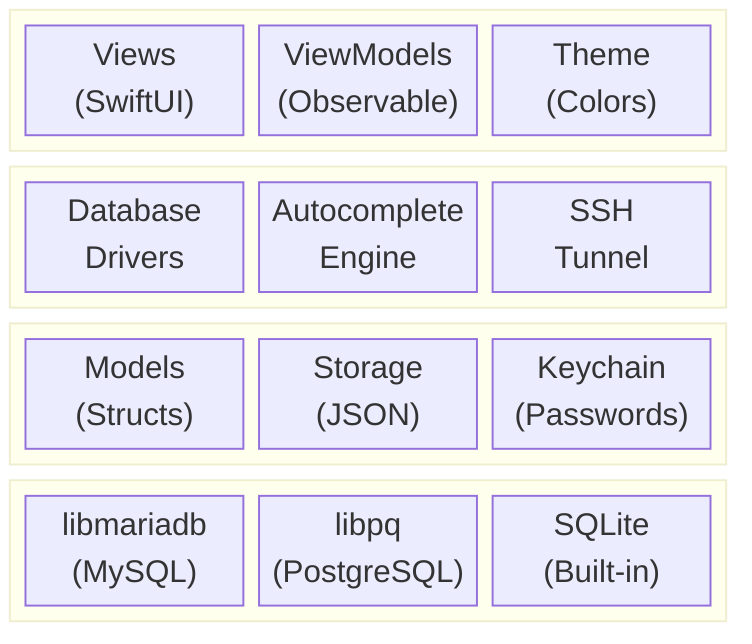
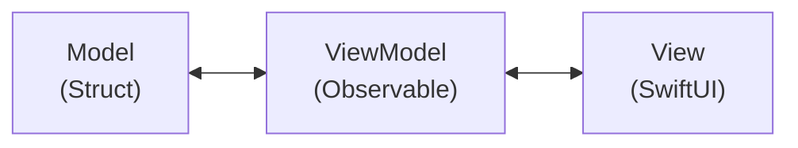
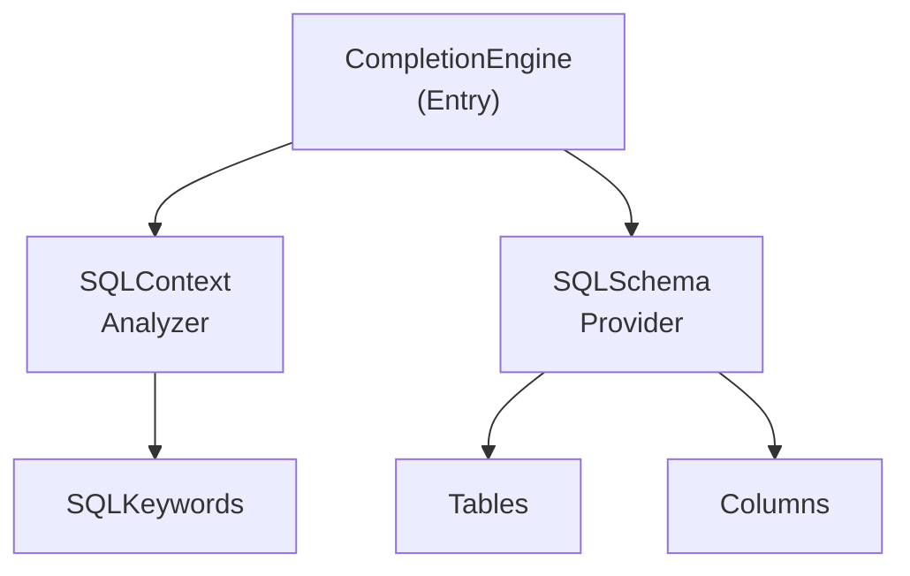
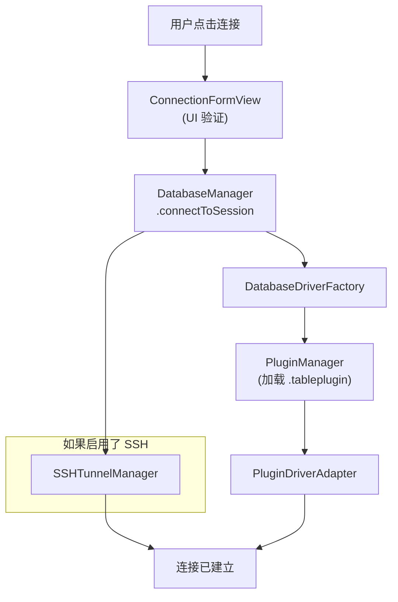
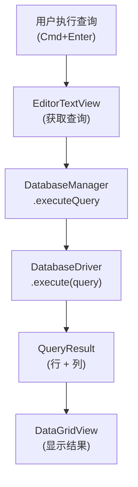

# 架构

TablePro 使用以下技术构建：

- **SwiftUI** 用于 UI
- **AppKit** 用于底层 macOS 集成
- **Swift Concurrency**（async/await、actors）用于并发操作
- **原生 C 库**用于数据库连接



## 依赖

SPM 依赖：

| 包 | 版本 | 用途 |
|---------|---------|---------|
| **CodeEditSourceEditor** | 0.15.2+ | 基于 Tree-sitter 的代码编辑器，用于 SQL 编辑器 |
| **Sparkle** | 2.x | 支持 EdDSA 签名的自动更新框架 |

<Note>
CodeEditSourceEditor 捆绑了一个 SwiftLint 插件，CLI 构建时需要 `-skipPackagePluginValidation` 参数。详见[构建](/zh/development/building)。
</Note>

## 目录结构

<Tree>
  <Tree.Folder name="TablePro" defaultOpen>
    <Tree.Folder name="Core">
      <Tree.Folder name="Database">
        <Tree.File name="DatabaseDriver.swift" />
        <Tree.File name="DatabaseManager.swift" />
      </Tree.Folder>
      <Tree.Folder name="Plugins">
        <Tree.File name="PluginManager.swift" />
        <Tree.File name="PluginDriverAdapter.swift" />
      </Tree.Folder>
      <Tree.Folder name="Autocomplete" />
      <Tree.Folder name="Services" />
      <Tree.Folder name="SSH" />
    </Tree.Folder>
    <Tree.Folder name="Views" />
    <Tree.Folder name="Models" />
    <Tree.Folder name="ViewModels" />
    <Tree.Folder name="Extensions" />
    <Tree.Folder name="Theme" />
    <Tree.Folder name="Resources" />
  </Tree.Folder>
  <Tree.Folder name="Plugins" defaultOpen>
    <Tree.Folder name="TableProPluginKit" />
    <Tree.Folder name="MySQLDriverPlugin" />
    <Tree.Folder name="PostgreSQLDriverPlugin" />
    <Tree.File name="..." />
  </Tree.Folder>
  <Tree.Folder name="Libs" />
  <Tree.Folder name="TableProTests" />
  <Tree.Folder name="scripts" />
</Tree>

## 设计模式

### MVVM 架构



**Models**：纯数据结构（structs、enums）
```swift
struct DatabaseConnection: Codable, Identifiable {
    let id: UUID
    var name: String
    var host: String
    var port: Int
    var type: DatabaseType
}
```

**ViewModels**：可观察的状态容器
```swift
@MainActor
class DatabaseManager: ObservableObject {
    @Published var sessions: [DatabaseSession] = []
    @Published var activeSessionId: UUID?

    func connect(to connection: DatabaseConnection) async throws {
        // 业务逻辑
    }
}
```

**Views**：声明式 SwiftUI
```swift
struct ConnectionFormView: View {
    @StateObject private var dbManager = DatabaseManager.shared

    var body: some View {
        Form {
            // UI 元素
        }
    }
}
```

### 面向协议设计

所有数据库驱动遵循统一协议：

```swift
protocol DatabaseDriver: AnyObject {
    var connection: DatabaseConnection { get }
    var status: ConnectionStatus { get }

    func connect() async throws
    func disconnect()
    func execute(query: String) async throws -> QueryResult
    func fetchTables() async throws -> [TableInfo]
    // ...
}
```

数据库驱动以 `.tableplugin` bundle 形式实现，在运行时加载。每个插件实现共享 `TableProPluginKit` 框架中的 `DriverPlugin` 和 `PluginDatabaseDriver`。`PluginDriverAdapter` 将 `PluginDatabaseDriver` 桥接到核心 `DatabaseDriver` 协议。

### Actor 隔离

并发操作使用 Swift actors：

```swift
actor SSHTunnelManager {
    static let shared = SSHTunnelManager()

    private var tunnels: [UUID: SSHTunnel] = [:]

    func createTunnel(
        connectionId: UUID,
        sshHost: String,
        // ...
    ) async throws -> Int {
        // 线程安全的隧道管理
    }
}
```

### 插件系统

驱动创建使用基于插件的工厂模式。`PluginManager` 在运行时发现并加载 `.tableplugin` bundle。`DatabaseDriverFactory` 通过 `DatabaseType.pluginTypeId` 查找插件，并使用 `PluginDriverAdapter` 将其包装为核心 `DatabaseDriver` 协议。无需 switch 语句或硬编码的驱动列表。

## 核心组件

### DatabaseManager

所有数据库操作的中央管理器：

- 管理活跃会话
- 协调连接/断开操作
- 处理 SSH 隧道生命周期
- 向 UI 发布状态变更

```swift
@MainActor
class DatabaseManager: ObservableObject {
    static let shared = DatabaseManager()

    @Published var sessions: [DatabaseSession] = []
    @Published var activeSessionId: UUID?

    func connectToSession(_ connection: DatabaseConnection) async throws
    func disconnectSession(_ id: UUID) async
    func executeQuery(_ query: String) async throws -> QueryResult
}
```

### 数据库驱动插件

每个驱动是 `Plugins/` 下的 `.tableplugin` bundle：

| 插件 | 数据库类型 | C 桥接 |
|--------|---------------|----------|
| MySQLDriverPlugin | MySQL, MariaDB | CMariaDB (libmariadb) |
| PostgreSQLDriverPlugin | PostgreSQL, Redshift | CLibPQ (libpq) |
| SQLiteDriverPlugin | SQLite | Foundation sqlite3 |
| ClickHouseDriverPlugin | ClickHouse | URLSession HTTP |
| MSSQLDriverPlugin | SQL Server | CFreeTDS |
| MongoDBDriverPlugin | MongoDB | CLibMongoc |
| RedisDriverPlugin | Redis | CRedis |
| OracleDriverPlugin | Oracle | OracleNIO (SPM) |

### 自动补全引擎



- **CompletionEngine**：主入口
- **SQLContextAnalyzer**：解析查询上下文
- **SQLSchemaProvider**：提供 schema 信息
- **SQLKeywords**：SQL 关键字定义

### SSH 隧道管理器

基于 Actor 的 SSH 隧道管理：

```swift
actor SSHTunnelManager {
    private var tunnels: [UUID: SSHTunnel] = [:]

    func createTunnel(...) async throws -> Int
    func closeTunnel(connectionId: UUID) async throws
    func hasTunnel(connectionId: UUID) -> Bool
}
```

特性：
- 通过系统 `ssh` 命令进行端口转发
- 密码和密钥认证
- 健康监测
- 自动清理

## 数据流

### 连接流程



### 查询执行流程



## 状态管理

### Published 属性

UI 状态使用 `@Published`：

```swift
@MainActor
class DatabaseManager: ObservableObject {
    @Published var sessions: [DatabaseSession] = []
    @Published var activeSessionId: UUID?
    @Published var isConnecting = false
}
```

### App Storage

设置通过 `@AppStorage` 持久化：

```swift
@AppStorage("appearance.theme") var theme: AppTheme = .system
@AppStorage("editor.fontSize") var fontSize: Int = 13
```

### Environment

通过 SwiftUI environment 共享状态：

```swift
@main
struct TableProApp: App {
    @StateObject private var dbManager = DatabaseManager.shared

    var body: some Scene {
        WindowGroup {
            ContentView()
                .environmentObject(dbManager)
        }
    }
}
```

## 错误处理

### 驱动错误

每个驱动定义特定的错误类型：

```swift
enum MySQLError: Error, LocalizedError {
    case connectionFailed(String)
    case queryFailed(String)
    case authenticationFailed

    var errorDescription: String? {
        switch self {
        case .connectionFailed(let msg): return "Connection failed: \(msg)"
        case .queryFailed(let msg): return "Query failed: \(msg)"
        case .authenticationFailed: return "Authentication failed"
        }
    }
}
```

### 错误传播

错误通过 async/await 传播：

```swift
func executeQuery(_ query: String) async throws -> QueryResult {
    guard let driver = activeDriver else {
        throw DatabaseError.notConnected
    }
    return try await driver.execute(query: query)
}
```

## 测试

### 单元测试

测试位于 `TableProTests/`：

```swift
final class MySQLDriverTests: XCTestCase {
    func testConnectionString() throws {
        let connection = DatabaseConnection(...)
        let driver = MySQLDriver(connection: connection)
        XCTAssertEqual(driver.connectionString, "expected")
    }
}
```

### 集成测试

```swift
func testExecuteQuery() async throws {
    let driver = MySQLDriver(connection: testConnection)
    try await driver.connect()
    defer { driver.disconnect() }

    let result = try await driver.execute(query: "SELECT 1")
    XCTAssertEqual(result.rowCount, 1)
}
```

## 下一步

<CardGroup cols={2}>
  <Card title="代码风格" icon="code" href="/zh/development/code-style">
    编码规范和风格指南
  </Card>
  <Card title="构建" icon="hammer" href="/zh/development/building">
    构建和发布流程
  </Card>
  <Card title="环境搭建" icon="wrench" href="/zh/development/setup">
    开发环境搭建
  </Card>
  <Card title="GitHub" icon="github" href="https://github.com/datlechin/tablepro">
    源代码仓库
  </Card>
</CardGroup>
